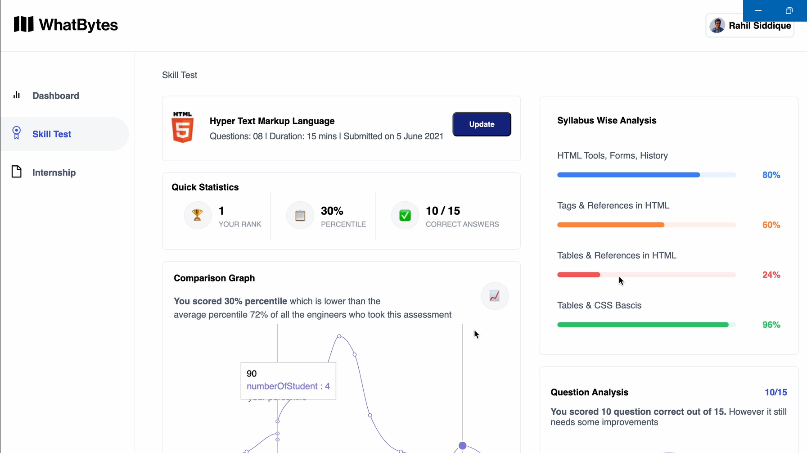

# Skill Test Dashboard

A modern, responsive dashboard for visualizing and managing skill test results built with Next.js, React, and Tailwind CSS.



## Overview

This application provides a comprehensive interface for users to view and analyze their performance in skill assessment tests. The dashboard displays various metrics including rank, percentile, and correct answers, along with visual representations of performance through charts and graphs.

## Features

- **Interactive Dashboard**: View key performance metrics at a glance
- **Performance Analytics**: Analyze test results with detailed breakdowns
- **Syllabus-wise Analysis**: See performance across different topic areas
- **Comparison Graph**: Compare your performance against other test-takers
- **Question Analysis**: Visual representation of correct vs. incorrect answers
- **Responsive Design**: Fully responsive layout that works on desktop and mobile devices
- **Update Functionality**: Ability to update test results through a modal form

## Tech Stack

- **Framework**: [Next.js](https://nextjs.org/) (v15.2.4)
- **UI Library**: [React](https://react.dev/) (v19)
- **Styling**: [Tailwind CSS](https://tailwindcss.com/) (v3.4.17)
- **UI Components**: 
  - [Radix UI](https://www.radix-ui.com/) for accessible components
  - [Recharts](https://recharts.org/) for data visualization
- **Form Handling**: [React Hook Form](https://react-hook-form.com/)
- **Validation**: [Zod](https://zod.dev/)
- **Icons**: [Lucide React](https://lucide.dev/guide/packages/lucide-react)

## Getting Started

### Prerequisites

- Node.js (v18 or higher recommended)
- npm, yarn, or pnpm

### Installation

1. Clone the repository:
   ```bash
   git clone <repository-url>
   cd skill-test-dashboard
   ```

2. Install dependencies:
   ```bash
   npm install
   # or
   yarn install
   # or
   pnpm install
   ```

3. Run the development server:
   ```bash
   npm run dev
   # or
   yarn dev
   # or
   pnpm dev
   ```

4. Open [http://localhost:3000](http://localhost:3000) in your browser to see the application.

## Project Structure

```
skill-test-dashboard/
├── app/                  # Next.js app directory
│   ├── globals.css       # Global styles
│   ├── layout.tsx        # Root layout component
│   └── page.tsx          # Main dashboard page
├── components/           # React components
│   ├── ui/               # UI components (buttons, cards, etc.)
│   ├── circular-progress.tsx  # Circular progress indicator
│   ├── comparison-graph.tsx   # Performance comparison graph
│   ├── skill-test-sidebar.tsx # Sidebar navigation
│   ├── update-form.tsx        # Form for updating test results
│   └── user-profile.tsx       # User profile component
├── hooks/                # Custom React hooks
├── lib/                  # Utility functions
├── public/               # Static assets
└── styles/               # Additional styles
```

## Customization

### Theming

The application uses Tailwind CSS for styling. You can customize the theme by modifying the `tailwind.config.ts` file.

### Adding New Components

1. Create a new component in the `components` directory
2. Import and use it in your pages or other components

### Data Management

Currently, the application uses React state for data management. For a production application, you might want to:

1. Connect to a backend API
2. Implement authentication
3. Add data persistence with a database

## Deployment

This Next.js application can be deployed on various platforms:

- [Vercel](https://vercel.com/) (recommended for Next.js)
- [Netlify](https://www.netlify.com/)
- [AWS Amplify](https://aws.amazon.com/amplify/)
- Any platform that supports Node.js applications

## Contributing

Contributions are welcome! Please feel free to submit a Pull Request.

## License

This project is licensed under the MIT License - see the LICENSE file for details.